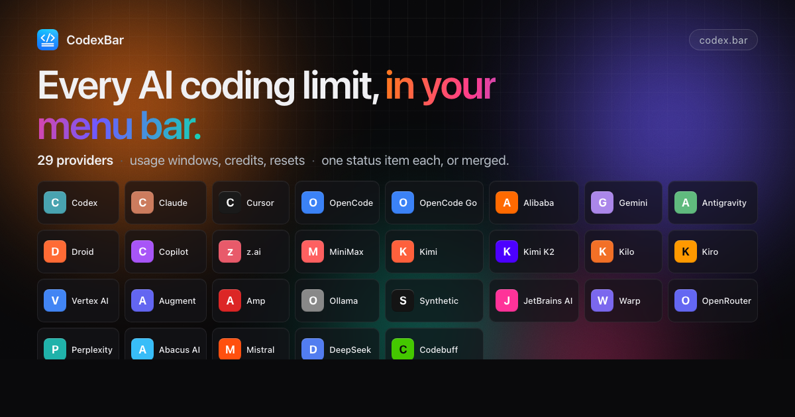

# CodexBar 🎚️ — May your tokens never run out.

> Every AI coding limit, in your menu bar.

[](https://github.com/steipete/CodexBar/releases/latest)
[](https://github.com/steipete/CodexBar/releases/latest)
[](https://github.com/steipete/homebrew-tap)
[](LICENSE)
[](https://codexbar.app)

<a href="https://codexbar.app"></a>

Tiny macOS 14+ menu bar app that keeps **AI coding-provider limits visible** and shows when each window resets. Codex, Claude, Cursor, Gemini, Copilot, z.ai, Kiro, Vertex AI, Augment, OpenRouter, Codebuff, Command Code, and many newer coding providers. One status item per provider, or Merge Icons mode with a provider switcher. No Dock icon, minimal UI, dynamic bar icons.


## Why

- **Plan around resets.** Per-provider session, weekly, and monthly windows with countdowns to the next reset — stop guessing whether to start that long task.
- **Credits, spend, and cost scans.** Credit balances and monthly spend where the provider exposes them, plus a local cost scan over the last 30 days for Codex and Claude.
- **Live status.** Provider status polling surfaces incident badges in the menu and an indicator overlay on the bar icon.
- **Privacy-first.** Reuses existing provider sessions — OAuth, device flow, API keys, browser cookies, local files — so no passwords are stored.

这个 fork 的目标很直接：让中文用户打开应用后能直接看懂、直接配置、直接排查，不需要在英文设置项、英文错误提示、provider 名称和不同 API 来源之间来回猜。


## 这个版本适合谁

- 同时使用多款 AI 编程工具，希望在菜单栏里快速看额度、余额、窗口重置时间和服务状态。
- 主要使用中文或亚洲区域常见 AI 服务，例如月之暗面 Kimi、千问、豆包、Trae、小米 Mimo、智谱 z.ai、MiniMax、阶跃星辰、阿里云百炼。
- 想使用中文界面、中文错误提示和更贴近国内服务命名习惯的 provider 名称。
- 希望通过 GitHub Actions 获取本 fork 的 macOS App 和 Linux CLI 构建产物，而不是安装上游原版。

## 与上游版本的区别

### 中文化体验

- 菜单栏、Overview、Provider 设置页、按钮、状态、错误提示、CLI 输出中的用户可见文案已中文化。
- 国内 AI provider 使用中文名称，例如千问、豆包、阶跃星辰、小米 Mimo、智谱 z.ai、月之暗面 Kimi、阿里云百炼。
- 保留必要技术词和品牌名，例如 `API key`、`Cookie`、`Token`、OAuth、Codex、Claude、Cursor、OpenRouter。

### Provider 覆盖

在上游 Codex、Claude、Cursor、Gemini、Copilot、Kiro、Vertex AI、Augment、Amp、JetBrains AI、OpenRouter、Perplexity、Abacus AI 等 provider 的基础上，本 fork 额外补充或强化了这些中文用户更常见的服务：

- 月之暗面 Kimi：读取 weekly quota 和 5 小时窗口。
- 月之暗面 Kimi K2：读取 API credit 用量。
- 千问：面向阿里云百炼/千问相关额度入口。
- 阿里云百炼 Coding Plan：独立于千问 provider 的 Coding Plan 数据源。
- 豆包：火山方舟/豆包相关订阅和额度入口。
- Trae：Trae 账号用量入口。
- 小米 Mimo：读取小米 Mimo token plan 和余额，支持 API key、浏览器 Cookie 或手动 Cookie。
- 智谱 z.ai：支持 z.ai/BigModel 相关 quota 和 MCP window。
- MiniMax：MiniMax Coding Plan 用量读取。
- 阶跃星辰、Zenmux、AigoCode：补充国内/亚洲开发者常见平台入口。

### Overview 和刷新

- Overview 会尽量显示所有已启用、可选择的 API/provider。
- 支持合并图标模式，多个 provider 可以合并到同一个菜单栏入口。
- 支持手动刷新以及 1 分钟、2 分钟、5 分钟、15 分钟等刷新节奏。
- Provider 刷新策略有 CI 覆盖，避免后台刷新、实时显示和 Overview 逻辑回退。

### 构建和发布

- macOS App 通过 GitHub Actions 打包为 zip artifact，并更新 continuous pre-release。
- Linux CLI 通过 GitHub Actions 构建 x64 和 arm64。
- CI 会运行 lint、实时刷新策略测试、Swift Test 和 Linux CLI smoke test。

## 安装

### 系统要求

- macOS 14 Sonoma 或更新版本。
- Linux 仅支持 CLI，不支持菜单栏 App。

### 从本 fork 下载

优先使用 Leo fork 的构建产物：

- Releases: <https://github.com/LeoLin990405/CodexBar/releases>
- Actions artifacts: <https://github.com/LeoLin990405/CodexBar/actions>

### 关于 Homebrew

如果你运行：

```bash
brew install --cask steipete/tap/codexbar
```

### CLI Tarballs (macOS/Linux)
Homebrew formula (Linux today):
```bash
brew install steipete/tap/codexbar
```
Or download release tarballs from GitHub Releases:
- macOS: `CodexBarCLI-v<tag>-macos-arm64.tar.gz`, `CodexBarCLI-v<tag>-macos-x86_64.tar.gz`
- Linux: `CodexBarCLI-v<tag>-linux-aarch64.tar.gz`, `CodexBarCLI-v<tag>-linux-x86_64.tar.gz`

### First run
- Open Settings → Providers and enable what you use.
- Install/sign in to the provider sources you rely on: CLIs, browser sessions, OAuth/device flow, API keys, local app files, or provider apps depending on the provider.
- Optional: Settings → Providers → Codex → OpenAI cookies (Automatic or Manual) to add dashboard extras.

## 菜单栏图标

- [Codex](docs/codex.md) — OAuth API or local Codex CLI, plus optional OpenAI web dashboard extras.
- [Claude](docs/claude.md) — OAuth API, browser cookies, or CLI PTY fallback; session and weekly usage where available.
- [Cursor](docs/cursor.md) — Browser session cookies for plan + usage + billing resets.
- [OpenCode](docs/opencode.md) — Browser cookies for workspace subscription usage.
- [OpenCode Go](docs/opencode.md) — Browser cookies for Go usage windows.
- [Alibaba Coding Plan](docs/alibaba-coding-plan.md) — Web cookies or API key for coding-plan quotas.
- [Gemini](docs/gemini.md) — OAuth-backed quota API using Gemini CLI credentials (no browser cookies).
- [Antigravity](docs/antigravity.md) — Local language server probe (experimental); no external auth.
- [Droid](docs/factory.md) — Browser cookies + WorkOS token flows for Factory usage + billing.
- [Copilot](docs/copilot.md) — GitHub device flow + Copilot internal usage API.
- [z.ai](docs/zai.md) — API token for quota + MCP windows.
- [Manus](docs/manus.md) — Browser `session_id` auth for credit balance, monthly credits, and daily refresh tracking.
- [MiniMax](docs/minimax.md) — API token, cookie header, or browser cookies for coding-plan usage.
- [Kimi](docs/kimi.md) — Auth token (JWT from `kimi-auth` cookie) for weekly quota + 5‑hour rate limit.
- [Kimi K2](docs/kimi-k2.md) — API key for credit-based usage totals.
- [Kilo](docs/kilo.md) — API token with CLI-auth fallback for Kilo Pass usage.
- [Kiro](docs/kiro.md) — CLI-based usage; monthly credits + bonus credits.
- [Vertex AI](docs/vertexai.md) — Google Cloud gcloud OAuth with token cost tracking from local Claude logs.
- [Augment](docs/augment.md) — Augment CLI or browser cookies for credits tracking and usage monitoring.
- [Amp](docs/amp.md) — Browser cookie-based authentication with Amp Free usage tracking.
- [Ollama](docs/ollama.md) — Browser cookies for Ollama Cloud usage windows.
- [JetBrains AI](docs/jetbrains.md) — Local XML-based quota from JetBrains IDE configuration; monthly credits tracking.
- [Warp](docs/warp.md) — API token for GraphQL request limits and monthly credits.
- [OpenRouter](docs/openrouter.md) — API token for credit-based usage tracking across multiple AI providers.
- Perplexity — Account usage credits from Perplexity usage data.
- [Abacus AI](docs/abacus.md) — Browser cookie auth for ChatLLM/RouteLLM compute credit tracking.
- Mistral — Browser cookies for monthly spend tracking.
- [DeepSeek](docs/deepseek.md) — API key for credit balance tracking (paid vs. granted breakdown).
- [Moonshot / Kimi API](docs/moonshot.md) — API key for Moonshot/Kimi API account balance tracking.
- [Venice](docs/venice.md) — API key for DIEM or USD balance tracking.
- [Codebuff](docs/codebuff.md) — API token (or `~/.config/manicode/credentials.json`) for credit balance + weekly rate limit.
- [Crof](docs/crof.md) — API key for dollar credit balance and request quota tracking.
- [Command Code](docs/command-code.md) — Browser cookies for monthly USD credits from Command Code billing.
- [StepFun](docs/stepfun.md) — Username + password login for Step Plan rate limits (5‑hour + weekly windows) and subscription plan name.
- Open to new providers: [provider authoring guide](docs/provider.md).

## Icon & Screenshot
The menu bar icon is a tiny usage meter. Bar meaning is provider-specific, and errors/stale data can dim the icon or
show an incident indicator.

## Features
- Multi-provider menu bar with per-provider toggles (Settings → Providers).
- Provider-specific usage meters with reset countdowns.
- Optional Codex web dashboard enrichments (code review remaining, usage breakdown, credits history).
- Local cost-usage scan for Codex + Claude (last 30 days).
- Provider status polling with incident badges in the menu and icon overlay.
- Merge Icons mode to combine providers into one status item + switcher.
- Display controls for provider icons, labels, bars, reset-time style, and highest-usage auto-selection.
- Refresh cadence presets (manual, 1m, 2m, 5m, 15m).
- Bundled CLI (`codexbar`) for scripts and CI (including `codexbar cost --provider codex`, `claude`, or `both` for local cost usage); macOS and Linux CLI builds available.
- WidgetKit widgets for supported providers.
- Optional session quota notifications and weekly-reset confetti.
- Privacy-first: on-device parsing by default; browser cookies are opt-in and reused (no passwords stored).

## Privacy note
Wondering if CodexBar scans your disk? It doesn’t crawl your filesystem; it reads a small set of known locations (browser cookies/local storage, provider config files, local JSONL logs) when the related features are enabled. Provider tokens and token-account settings live in `~/.codexbar/config.json` with restrictive file permissions. See the discussion and audit notes in [issue #12](https://github.com/steipete/CodexBar/issues/12).

## macOS permissions (why they’re needed)
- **Full Disk Access (optional)**: only required to read Safari cookies/local storage for web-based providers. If you don’t grant it, use another supported browser, manual cookies/API keys, OAuth, or CLI/local sources where that provider supports them.
- **Keychain access (prompted by macOS)**:
  - Chromium cookie import needs the browser “Safe Storage” key to decrypt cookies.
  - Claude OAuth bootstrap may read the Claude CLI Keychain item when CodexBar has no usable cached credentials.
  - CodexBar may use Keychain for browser cookie decryption, cached cookie headers, and OAuth/device-flow credentials where those sources require it.
  - **How do I prevent those keychain alerts?**
    - Open **Keychain Access.app** → login keychain → search the prompted item (for Claude OAuth, usually “Claude Code-credentials”).
    - Open the item → **Access Control** → add `CodexBar.app` under “Always allow access by these applications”.
    - Prefer adding just CodexBar (avoid “Allow all applications” unless you want it wide open).
    - Relaunch CodexBar after saving.
    - Reference screenshot: 
  - **How to do the same for the browser?**
    - Find the browser’s “Safe Storage” key (e.g., “Chrome Safe Storage”, “Brave Safe Storage”, “Microsoft Edge Safe Storage”).
    - Open the item → **Access Control** → add `CodexBar.app` under “Always allow access by these applications”.
    - This removes the prompt when CodexBar decrypts cookies for that browser.
- **Files & Folders prompts (folder/volume access)**: CodexBar launches provider CLIs and local probes for some providers. If those helpers read a project directory or external drive, macOS may ask CodexBar for that folder/volume (e.g., Desktop or an external volume). This is driven by the helper’s working directory, not background disk scanning.
- **What we do not request in the background**: no Screen Recording or Accessibility permissions; user-triggered helper actions may ask macOS for Automation permission to open Terminal. No passwords are stored (browser cookies are reused when you opt in).

## Docs
- Providers overview: [docs/providers.md](docs/providers.md)
- Provider authoring: [docs/provider.md](docs/provider.md)
- Issue labeling guide: [docs/ISSUE_LABELING.md](docs/ISSUE_LABELING.md)
- UI & icon notes: [docs/ui.md](docs/ui.md)
- CLI reference: [docs/cli.md](docs/cli.md)
- Configuration: [docs/configuration.md](docs/configuration.md)
- Widgets: [docs/widgets.md](docs/widgets.md)
- Architecture: [docs/architecture.md](docs/architecture.md)
- Refresh loop: [docs/refresh-loop.md](docs/refresh-loop.md)
- Status polling: [docs/status.md](docs/status.md)
- Sparkle updates: [docs/sparkle.md](docs/sparkle.md)
- Packaging: [docs/packaging.md](docs/packaging.md)
- Development: [docs/DEVELOPMENT.md](docs/DEVELOPMENT.md)
- Release checklist: [docs/RELEASING.md](docs/RELEASING.md)
- Changelog: [CHANGELOG.md](CHANGELOG.md)

## Getting started (dev)
- Clone the repo and open it in Xcode or run the scripts directly.
- Launch once, then toggle providers in Settings → Providers.
- Install/sign in to provider sources you rely on (CLIs, browser cookies, OAuth/device flow, API keys, or local app/config files).
- Optional: set OpenAI cookies (Automatic or Manual) for Codex dashboard extras.

## Build from source
Requires macOS 14+ and Swift 6.2+.

```bash
./Scripts/package_app.sh        # builds CodexBar.app in-place
CODEXBAR_SIGNING=adhoc ./Scripts/package_app.sh  # ad-hoc signing (no Apple Developer account)
open CodexBar.app
```

### 开发循环

```bash
./Scripts/compile_and_run.sh
./Scripts/compile_and_run.sh --test  # also run swift test before packaging/relaunching
make check                           # SwiftFormat + SwiftLint
make docs-list                       # list docs with frontmatter summaries
```

CLI install:
```bash
# after installing CodexBar.app in /Applications
./bin/install-codexbar-cli.sh
```

### 格式和检查

```bash
./Scripts/lint.sh lint
./Scripts/lint.sh format
swift test --no-parallel
```

本项目要求 Swift tools 6.2 或更新版本。macOS 和 Linux 的权威验证以 GitHub Actions 为准。

## GitHub Actions

本 fork 使用这些 workflow：

- `CI`：lint、实时刷新策略测试、Swift Test、Linux CLI 构建和 smoke test。
- `Release macOS App`：构建并打包 macOS App，上传 artifact，更新 continuous pre-release。
- `Build App` / `Release CLI`：用于补充打包和 CLI 发布流程。
- `Monitor Upstream Changes`：用于跟踪上游变更。

## 文档

- Provider 总览：[docs/providers.md](docs/providers.md)
- Provider 开发指南：[docs/provider.md](docs/provider.md)
- 配置说明：[docs/configuration.md](docs/configuration.md)
- CLI 参考：[docs/cli.md](docs/cli.md)
- 架构说明：[docs/architecture.md](docs/architecture.md)
- 刷新循环：[docs/refresh-loop.md](docs/refresh-loop.md)
- 状态轮询：[docs/status.md](docs/status.md)
- UI 和图标：[docs/ui.md](docs/ui.md)
- Widget：[docs/widgets.md](docs/widgets.md)
- 打包发布：[docs/RELEASING.md](docs/RELEASING.md)
- Fork 快速开始：[docs/FORK_QUICK_START.md](docs/FORK_QUICK_START.md)
- 上游同步策略：[docs/UPSTREAM_STRATEGY.md](docs/UPSTREAM_STRATEGY.md)

## 与上游的关系

原始项目由 Peter Steinberger 创建并维护：<https://github.com/steipete/CodexBar>。

这个 fork 会尽量保留上游架构、隐私边界和核心行为，同时在中文 UI、中文用户常用 provider、GitHub Actions 构建和本地使用体验上继续调整。适合所有用户的 bug fix 可以回馈上游；中文汉化、中文 provider 命名和 fork 专属配置会优先留在本 fork。

## 许可

MIT。原始项目版权归 Peter Steinberger 及贡献者所有；本 fork 的新增改动由对应贡献者保留署名。
